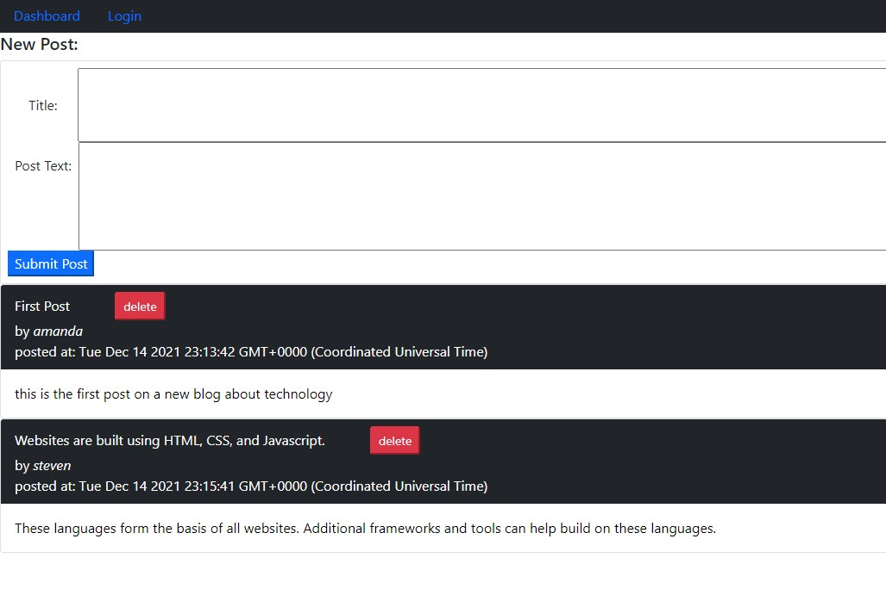

# CMS-style-blog

## Project Overview

This site allows users to post comments about technology and comment on other posts that they found helpful. Users will log-in an be able to post and comment. Users will only be able to delete their own posts.

## Deployed Version

Heroku: https://techno-blog-sosebee.herokuapp.com/

GitHub: https://github.com/steven-sosebee/CMS-style-blog



## Acceptance Criteria

```md
GIVEN a CMS-style blog site
WHEN I visit the site for the first time
THEN I am presented with the homepage, which includes existing blog posts if any have been posted; navigation links for the homepage and the dashboard; and the option to log in

[x] User is presented a landing page with the option to log in or continue to the dashboard without signing in.

WHEN I click on the homepage option
THEN I am taken to the homepage

[x] User is presented with the landing page by default. Clicking the 'Dashboard' menu option will take the user to the posts.

WHEN I click on any other links in the navigation
THEN I am prompted to either sign up or sign in

[x] The login or logout option will update depending on the status of the session.

WHEN I choose to sign up
THEN I am prompted to create a username and password

[x] User can create a new account on the sign-up form

WHEN I click on the sign-up button
THEN my user credentials are saved and I am logged into the site

[x] User will log in and the nav bar will welcome them to the site. User will be able to submit posts and comments.

WHEN I revisit the site at a later time and choose to sign in
THEN I am prompted to enter my username and password

[x] Session time-out is 10 minutes.

WHEN I am signed in to the site
THEN I see navigation links for the homepage, the dashboard,
and the option to log out

[x] The login option changes to logout

WHEN I click on the homepage option in the navigation
THEN I am taken to the homepage and presented with existing blog posts that include the post title and the date created

[x] Click the dashboard to see the existing posts.

WHEN I click on an existing blog post
THEN I am presented with the post title, contents, post creator’s username, and date created for that post and have the option to leave a comment

[x] All existing posts are displayed on the dashboard page.

WHEN I enter a comment and click on the submit button while signed in
THEN the comment is saved and the post is updated to display the comment, the comment creator’s username, and the date created

[x] Drill into the post to add a comment.

WHEN I click on the dashboard option in the navigation
THEN I am taken to the dashboard and presented with any blog posts I have already created and the option to add a new blog post

[x] The user is presented with a form to enter a post, if the user is not logged-in, the submit will redirect the user to the login screen.

WHEN I click on the button to add a new blog post
THEN I am prompted to enter both a title and contents for my blog post

[x] The form is present on the dashboard. The user inputs the information and hits submit to send their post to the back-end.

WHEN I click on the button to create a new blog post
THEN the title and contents of my post are saved and I am taken back to an updated dashboard with my new blog post

[x] The form is present on the dashboard. The user inputs the information and hits submit to send their post to the back-end.

WHEN I click on one of my existing posts in the dashboard
THEN I am able to delete or update my post and taken back to an updated dashboard

[x] User is able to delete their own posts and only when they are logged in.
WHEN I click on the logout option in the navigation
THEN I am signed out of the site

[x] Logout will destroy the session.

WHEN I am idle on the site for more than a set time
THEN I am able to view comments but I am prompted to log in again before I can add, update, or delete comments

[x] The session will end after 1 minute.
```
